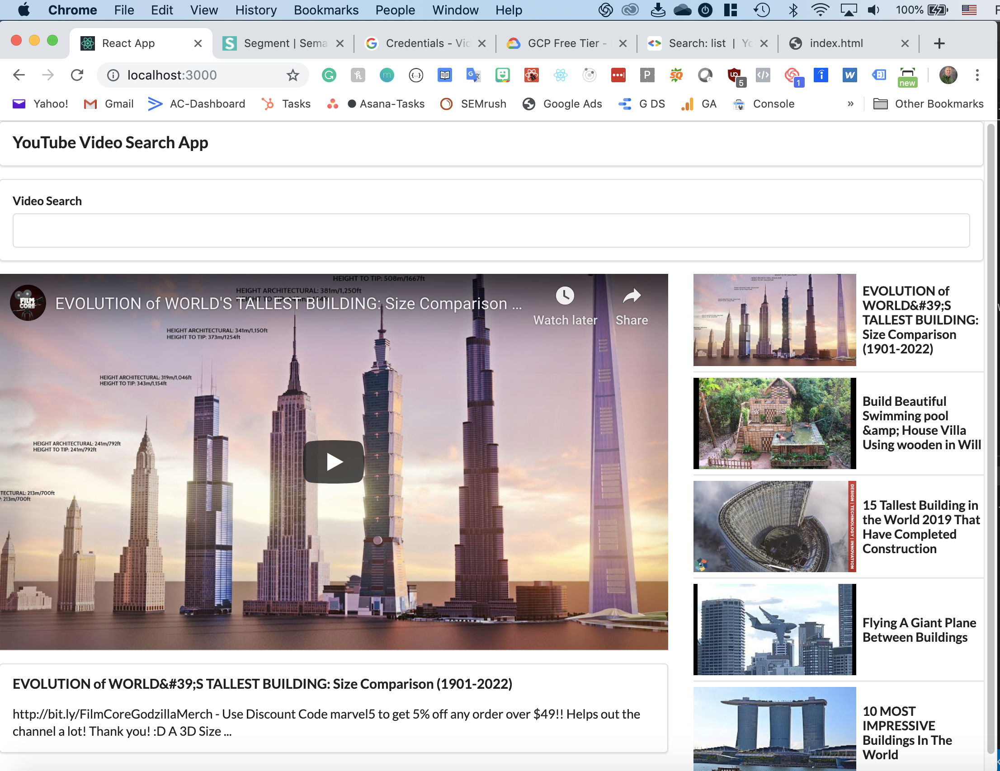

# YouTube Video Browser

Live URL: <a href="https://www.brianhafnertech.com/sites/youtube-video-browser/" target="_blank">https://www.brianhafnertech.com/sites/youtube-video-browser/</a>

This is a YouTube video search app using the YouTube API.

Background:
----------------------------------------------------
This is an app built from Stephen Grider's Modern React with Redux course on Udemy

Technology:
----------------------------------------------------
This uses React and the Semantic UI CSS library.

Semantic UI Library - https://semantic-ui.com/

Screenshot for YouTube Browser App:
--------------------------------

